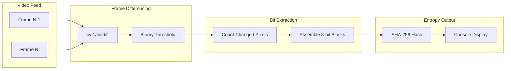

# Algorithmic Entropy Distillation — Frame Differencing & SHA-256

## Overview

This stage transforms raw video frames into cryptographic-quality random numbers. The core insight: by comparing successive frames of the chaotic LED array, we extract pixel-level changes that are fundamentally unpredictable — driven by the same thermodynamic and quantum processes that make Cloudflare's lava lamps effective entropy sources.

## The Algorithm Pipeline



## Stage 1: Frame Differencing

### Why Frame Differencing?

Each LED in the array fades chaotically at a different rate. Between any two consecutive frames:

- **No change** = 0 (black pixel)
- **Change detected** = 255 (white pixel) after thresholding

The pattern of white pixels after differencing is a fingerprint of that specific moment in time. Because the LED behavior is driven by hardware noise, no two frames produce the same diff pattern.

### Implementation

```python
import cv2
import numpy as np

prev_frame = cv2.cvtColor(frame1, cv2.COLOR_BGR2GRAY)  # Frame N-1
curr_frame = cv2.cvtColor(frame2, cv2.COLOR_BGR2GRAY)  # Frame N

# Compute absolute pixel difference
diff = cv2.absdiff(prev_frame, curr_frame)

# Threshold: only count meaningful changes
_, binary = cv2.threshold(diff, 15, 255, cv2.THRESH_BINARY)
```

**Key Parameters:**

| Parameter | Value | Purpose |
|-----------|-------|---------|
| Threshold | 15 | Filters sensor noise (values below 15 = background noise, not entropy) |
| Binary max | 255 | Standard binary encoding for changed/unchanged pixels |

## Stage 2: Bit Extraction

### Counting Changed Pixels

The number of pixels that changed between frames is our raw entropy measurement:

```python
pixel_changes = np.count_nonzero(binary)   # Total changed pixels
total_pixels = binary.shape[0] * binary.shape[1]
change_ratio = pixel_changes / total_pixels  # Normalized 0.0 - 1.0
```

### Bit Assembly

We collect change ratios over time and assemble them into 8-bit blocks:

```python
def collect_entropy_blocks(change_ratios):
    """Convert change ratio stream into 8-bit entropy blocks."""
    blocks = []
    current_byte = 0
    bit_position = 0

    for ratio in change_ratios:
        # Extract the least significant bit of scaled ratio
        bit = int((ratio * 255) % 2)
        current_byte = (current_byte << 1) | bit
        bit_position += 1

        if bit_position >= 8:
            blocks.append(current_byte)
            current_byte = 0
            bit_position = 0

    return bytes(blocks)
```

**Why the LSB?** The least significant bit of each measurement carries the most noise and therefore the most entropy. The MSB often correlates with overall brightness and is more predictable.

## Stage 3: SHA-256 Hashing

Raw entropy blocks are fed through SHA-256 to produce uniformly distributed cryptographic output:

```python
import hashlib

def hash_entropy_block(raw_bytes):
    """Convert raw entropy bytes into a SHA-256 digest."""
    return hashlib.sha256(raw_bytes).hexdigest()
```

**Why hash raw entropy?** SHA-256:
1. **Mixes** the entropy blocks into a uniform distribution
2. **Extends** entropy: a 256-bit output from any input size
3. **Passes** NIST statistical tests when input has at least 1 bit of entropy per byte

## Running the Extraction

```bash
# From captured video file
python entropy_core.py --input capture.mp4 --output entropy_seed.txt

# From live camera feed
python entropy_core.py --live --output entropy_seed.txt

# From a directory of frames
python entropy_core.py --frames ./captured_frames/ --output entropy_seed.txt
```

## Output Format

The script outputs lines to stdout and the specified file:

```
BLOCK 0001: a7b2c93d4e5f6a7b8c9d0e1f2a3b4c5d6e7f8a9b0c1d2e3f4a5b6c7d8e9f0a1b
BLOCK 0002: 1a2b3c4d5e6f7a8b9c0d1e2f3a4b5c6d7e8f9a0b1c2d3e4f5a6b7c8d9e0f1a2b
BLOCK 0003: f0e1d2c3b4a5968778695a4b3c2d1e0f1a2b3c4d5e6f7a8b9c0d1e2f3a4b5c6d7
...
```

Each block is 64 hex characters (256 bits) of cryptographic-quality entropy.

## Validation Tests

### 1. Chi-Square Test

Run a chi-square test on the output to verify uniform distribution:

```python
from scipy.stats import chisquare

# Count byte frequencies in the entropy output
byte_counts = [0] * 256
for block in entropy_blocks:
    for byte in block:
        byte_counts[byte] += 1

# Expected: equal distribution
expected = [len(entropy_blocks * 32) / 256] * 256
stat, p = chisquare(byte_counts, expected)
print(f"Chi-square p-value: {p}")
# p > 0.01 means uniform distribution (good entropy)
```

### 2. Compression Test

A file with good entropy should not compress well:

```bash
# Save entropy output to file
python entropy_core.py --live --output test_entropy.bin --raw
gzip test_entropy.bin

# Check compression ratio
ls -lh test_entropy.bin.gz
# If ratio > 95%, entropy is good
# If ratio < 80%, data is predictable
```

### 3. Running Chi-Square with ent (Unix)

```bash
# Install ent: https://www.fourmilab.ch/random/
python entropy_core.py --live --output entropy.bin --raw
ent entropy.bin
```

**Expected output (good entropy):**
```
Entropy = 7.999 bits per byte
Chi square = 256.00, p-value = 0.50
Arithmetic mean = 127.5
Monte Carlo Pi = 3.14 (error 0.01%)
Serial correlation = -0.001
```

## Entropy Quality Benchmarks

| Metric | Good Entropy | Acceptable | Poor |
|--------|-------------|------------|------|
| Entropy (bits/byte) | > 7.99 | > 7.9 | < 7.5 |
| Chi-square p-value | 0.1 - 0.9 | 0.01 - 0.99 | < 0.001 or > 0.999 |
| Serial correlation | < 0.01 | < 0.1 | > 0.1 |
| Compression ratio | > 98% | > 95% | < 90% |
| Arithmetic mean | 127.5 +/- 5 | 127.5 +/- 10 | Outside range |

## Improving Entropy Quality

If tests show poor entropy:

1. **Increase LED count** — More LEDs = more pixel changes per frame
2. **Add a diffuser** — Smoother light patterns create more subtle variations
3. **Reduce threshold** — Lower the binary threshold to capture more pixel changes
4. **Slow down the LED fade rate** — More intermediate steps between brightness levels
5. **Use multiple LSBs** — Extract 2-3 least significant bits per measurement
6. **Increase frame rate** — More frequent captures = more diff opportunities

## References

- [NIST SP 800-90B: Entropy Sources](https://csrc.nist.gov/publications/detail/sp/800-90b/final)
- [Cloudflare LavaRand: How It Works](https://blog.cloudflare.com/randomness-101-lavarand-in-production/)
- [SHA-256 on Wikipedia](https://en.wikipedia.org/wiki/SHA-2)

## Next Step

Once entropy quality is verified, the system is complete. Run the full pipeline autonomously for production entropy generation.
