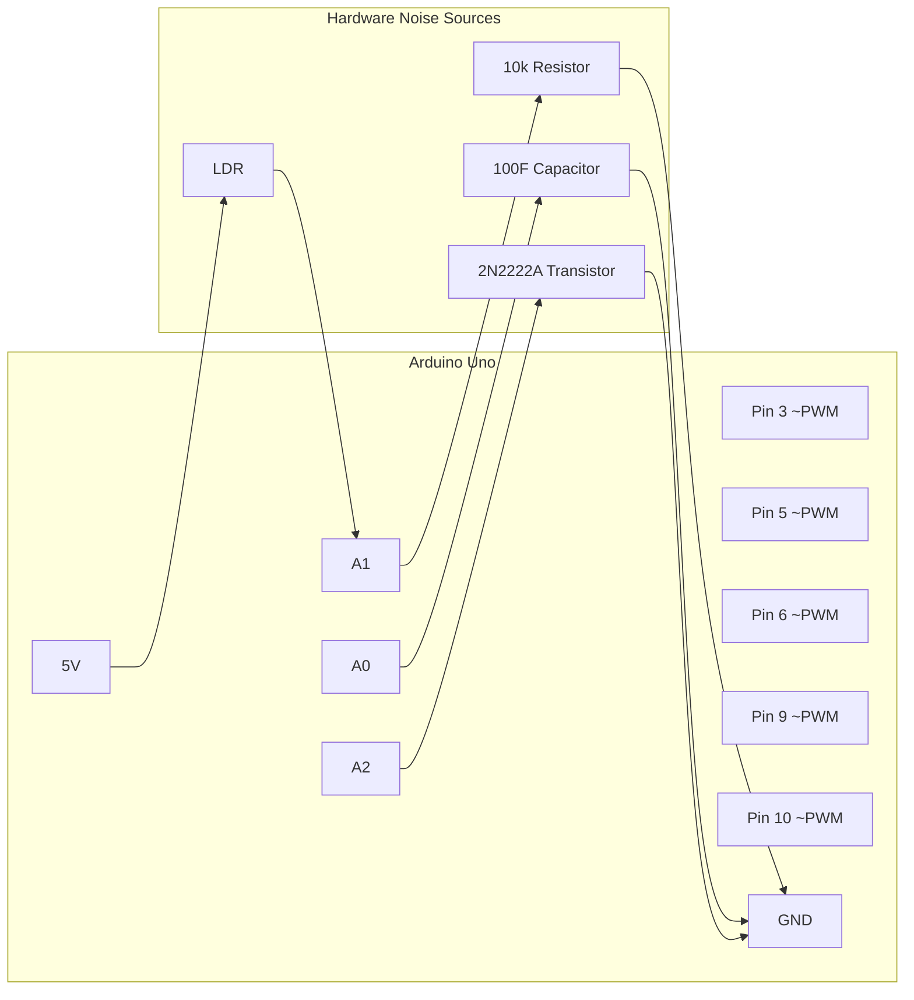
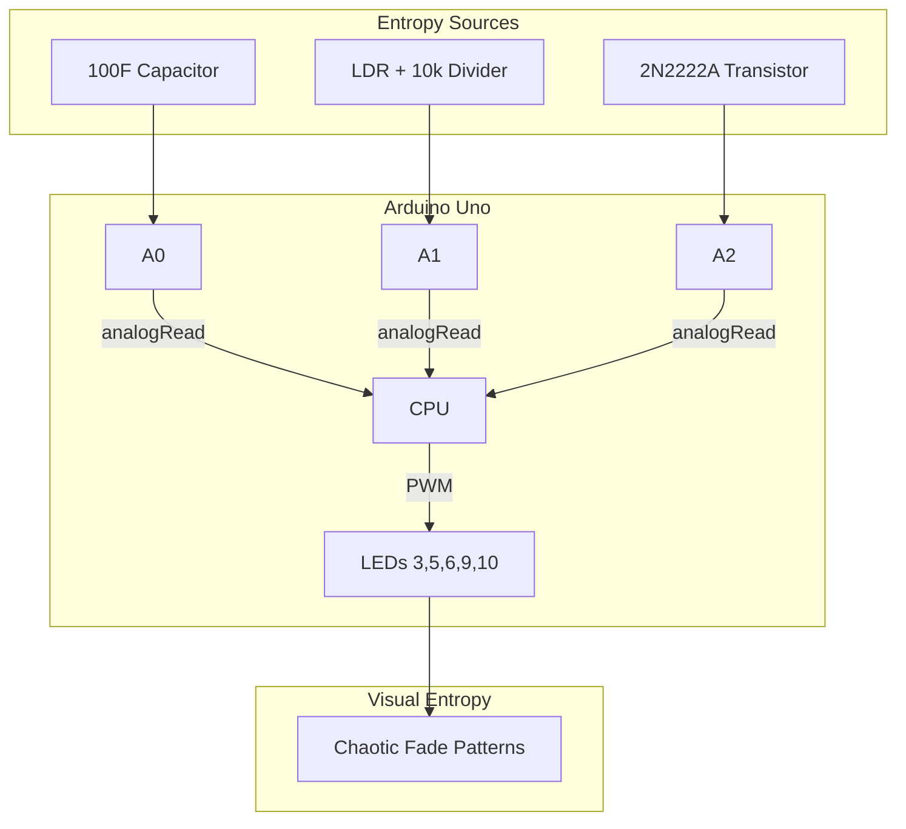

# Hardware Noise Wiring Guide — Capacitor, LDR & Transistor

## Overview

This guide upgrades the basic LED array from predictable software patterns into a genuinely unpredictable entropy source. We inject three independent sources of analog hardware noise into the Arduino's decision-making loop.

## Components Required

| Qty | Component | Specification | Purpose |
|-----|-----------|---------------|---------|
| 1 | Capacitor | 100F 25V polarized | Analog noise generation on A0 |
| 1 | NPN Transistor | 2N2222A | Thermal white noise on A2 |
| 1 | Photoresistor (LDR) | Standard CdS | Environmental light sensing on A1 |
| 1 | Resistor | 10k (Brown-Black-Orange) | LDR voltage divider |
| ~5 | Jumper Wires | Male-to-male | Additional connections |

## Circuit Schematic



## Step-by-Step Wiring

### Day 1: Fluctuating Noise Sources

#### 1A: Capacitor on A0 (+ 100F 25V Polarized)

The capacitor creates analog drift — its charge/discharge cycle introduces smooth but unpredictable voltage fluctuations.

**Wiring:**
1. Identify the capacitor's legs:
   - **Long leg** = Positive (+)
   - **Short leg** = Negative (-), usually marked with a stripe
2. Insert capacitor into breadboard (legs in separate rows)
3. Positive leg (+)  Jumper wire  A0 pin on Arduino
4. Negative leg (-)  GND rail (stripe side to ground)

**Polarity warning:** Reversing the capacitor can cause overheating or failure. The stripe side always goes to GND.

#### 1B: Transistor on A2 (2N2222A)

The 2N2222A transistor generates thermal noise when set up in a specific configuration, adding semiconductor-level randomness.

**Wiring:**
1. Face the flat side of the transistor toward you
2. Pin assignments (left to right): **Emitter  Base  Collector**
3. Connect **Collector** (right pin)  A2 on Arduino
4. Connect **Emitter** (left pin)  GND rail
5. **Base** (center pin) — leave unconnected (floating)

*This configures the transistor in a reverse-biased mode where electron tunneling creates measurable white noise.*

#### 1C: Noise Verification (Serial Monitor)

Upload this test to verify both sources are producing fluctuating values:

```cpp
void setup() {
  Serial.begin(9600);
}

void loop() {
  Serial.print("A0 (Capacitor): ");
  Serial.print(analogRead(A0));
  Serial.print("  A2 (Transistor): ");
  Serial.println(analogRead(A2));
  delay(100);
}
```

**Expected result:** Both values should drift unpredictably. A0 shows smoother drift (capacitor smoothing), A2 shows noisier random values (thermal noise).

Export a log and save it as `capacitor_noise_log.csv`:

```bash
# In Arduino IDE Serial Monitor, copy the output to a file
# Then save as /assets/capacitor_noise_log.csv
```

---

### Day 2: LDR Environmental Sensing (A1)

The photoresistor (LDR) brings real-world environmental light into your entropy, making the system responsive to room conditions, shadows, and movements.

#### LDR Voltage Divider Circuit

This is a classic voltage divider: `5V  LDR  A1  10k  GND`

**Step-by-step:**
1. Insert the LDR into the breadboard (legs in separate rows — LDRs have no polarity)
2. Connect one LDR leg  5V on Arduino
3. Connect the other LDR leg to a junction row
4. From the same junction row, connect a jumper to **A1** on Arduino
5. From the same junction row, connect one end of the 10k resistor
6. Connect the other end of the 10k resistor  GND rail

**Visual layout:**
```
5V
 │
[LDR]
 │
 ├── A1 (Arduino reads here)
 │
[10k Resistor]
 │
GND rail
```

**How it works:** When more light hits the LDR, its resistance drops, raising the voltage at A1. Less light = higher resistance = lower voltage at A1. This gives the Arduino a real-time window into the physical environment.

#### LDR Test Code

```cpp
void setup() {
  Serial.begin(9600);
}

void loop() {
  Serial.println(analogRead(A1));
  delay(100);
}
```

**Expected result:** Values change when you:
- Move your hand over the LDR
- Switch room lights on/off
- Cast shadows while walking past

---

### Day 3: Combined Entropy System

Once all three noise sources are wired, upload `LEDentropy.ino` (the full entropy sketch).

```bash
# Open LEDentropy.ino in Arduino IDE
# Select correct board and COM port
# Upload
# Open Serial Monitor at 9600 baud
```

You should see output like:
```
LDR: 742 | CapNoise: 134 | TransistorNoise: 207
LDR: 738 | CapNoise: 142 | TransistorNoise: 195
LDR: 751 | CapNoise: 128 | TransistorNoise: 211
```

All five LEDs will fade chaotically and independently — no repeating pattern.

## Complete Circuit Diagram



## Common Wiring Mistakes

| Symptom | Likely Cause | Fix |
|---------|-------------|-----|
| A0 reads 0 or 1023 always | Capacitor disconnected or reversed | Check polarity, check jumper to A0 |
| A1 reads 0 only | LDR resistor missing or GND broken | Verify 10k resistor is present and GND rail is connected |
| A2 always reads 0 | Transistor not connected | Check Collector (right pin)  A2, Emitter (left pin)  GND |
| LEDs don't light | No power to Arduino, or PWM pins not set | Verify USB connection, check pinMode in setup() |
| Serial Monitor shows nothing | Wrong baud rate or COM port | Set monitor to 9600 baud, verify COM port |

## Verification Checklist

- [ ] A0 reads fluctuating values with 100F capacitor
- [ ] A1 values change with ambient light (LDR working)
- [ ] A2 shows noisier random values (transistor thermal noise)
- [ ] All 5 LEDs fade chaotically with no repeating pattern
- [ ] Serial Monitor output shows all three noise sources
- [ ] Proof photo committed: `/assets/full_sensors.jpg`

## Next Step

Proceed to the **Camera & Sensor Integration** guide — mount a Raspberry Pi camera to capture the LED chaos and convert it to digital frames.
