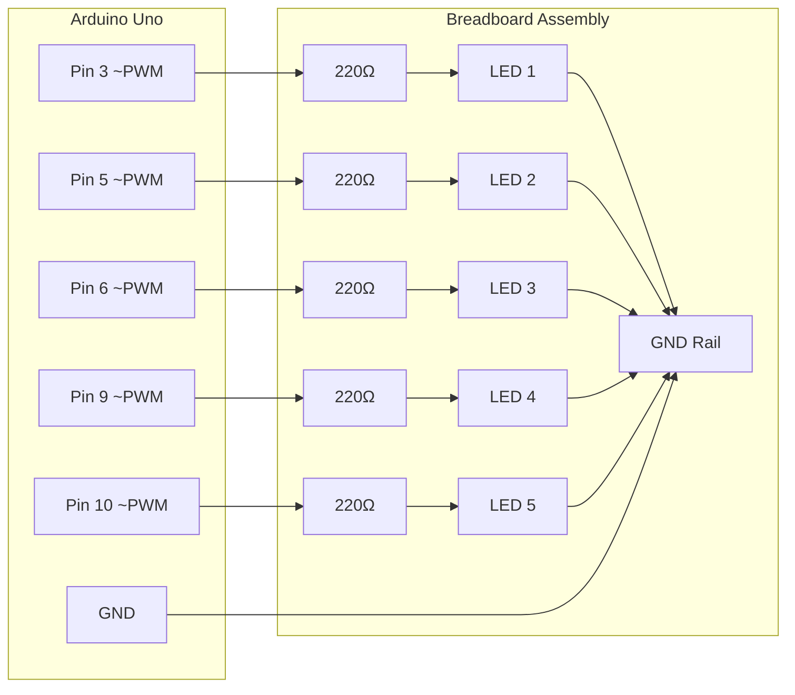

# Wiring Diagram: 5-LED Breadboard Array

## Overview
This document details the physical wiring topology for the LED-Entropy hardware base layer.

## Components Required

| Qty | Component | Specification |
|-----|-----------|---------------|
| 5 | LED Diodes | Standard 5mm, mixed colors recommended |
| 5 | Resistors | 220Ω (Red-Red-Brown) |
| 1 | Breadboard | Standard 830-point |
| 1 | Arduino Uno | Rev3 or compatible |
| ~15 | Jumper Wires | Male-to-male |

## Circuit Schematic (Mermaid)

## Pin Mapping Table

| Arduino Pin | PWM Capable | LED Position | Resistor |
|-------------|-------------|--------------|----------|
| 3 | Yes | LED 1 | 220Ω |
| 5 | Yes | LED 2 | 220Ω |
| 6 | Yes | LED 3 | 220Ω |
| 9 | Yes | LED 4 | 220Ω |
| 10 |  Yes | LED 5 | 220Ω |

## Wiring Instructions

### Step 1: LED Placement
- Place 5 LEDs **irregularly** (not in a straight line) across the breadboard
- Ensure anodes (longer leg, +) face the same direction for consistency
- Leave 2-3 rows between each LED for resistor placement

### Step 2: Resistor Connection
- Connect one 220Ω resistor to each LED **anode** (positive leg)
- Resistors provide current limiting to prevent LED burnout
- Formula: `R = (5V - 2V) / 0.015A ≈ 200Ω` → 220Ω standard value

### Step 3: PWM Pin Wiring
- Run jumper wires from resistor free ends to Arduino PWM pins
- Pin assignments: 3, 5, 6, 9, 10 (all PWM-capable)

### Step 4: Ground Rail
- Connect all LED **cathodes** (shorter leg, -) to breadboard negative rail
- Run single jumper from GND rail to Arduino GND pin

## Safety Notes

 **Current Limiting**: Always use 220Ω resistors. Direct connection will destroy LEDs.

 **Polarity**: LEDs are diodes — they only work in one direction. Anode to positive.

 **PWM Requirement**: Only pins 3, 5, 6, 9, 10, 11 support analogWrite() on Uno.

## Verification Checklist

- [ ] All 5 LEDs light when connected to 5V directly (test before wiring)
- [ ] Resistors measured with multimeter (200-240Ω range acceptable)
- [ ] No short circuits between adjacent breadboard rows
- [ ] GND rail continuity verified

## Physical Evidence

 **Proof Photo**: See `/assets/breadboard_assembly.jpg`
